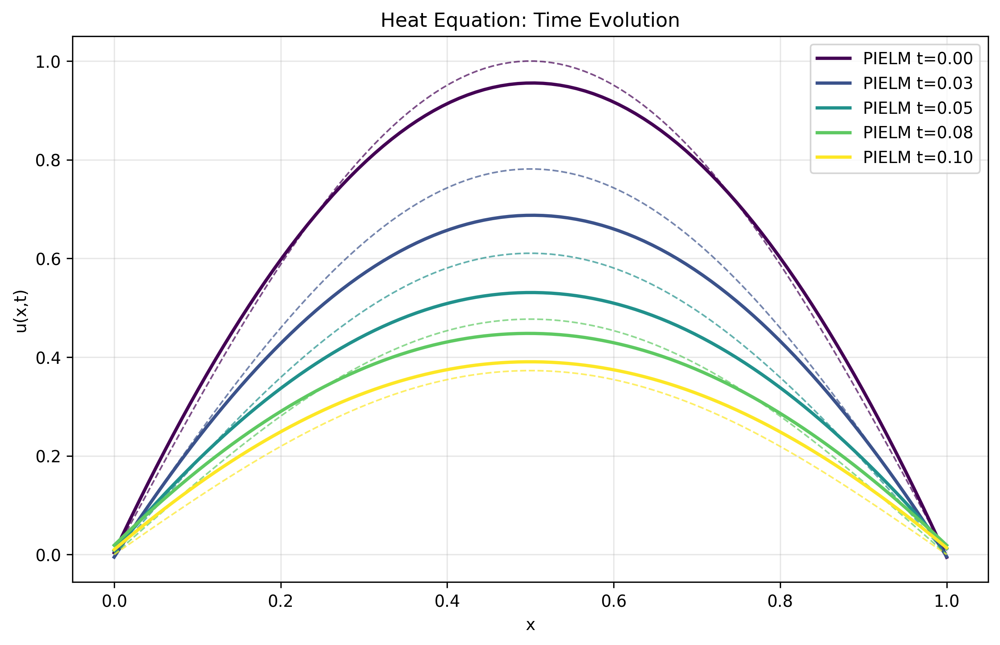
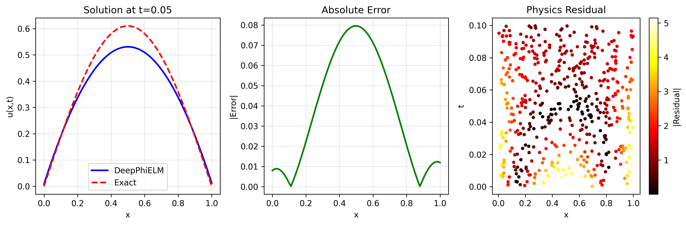
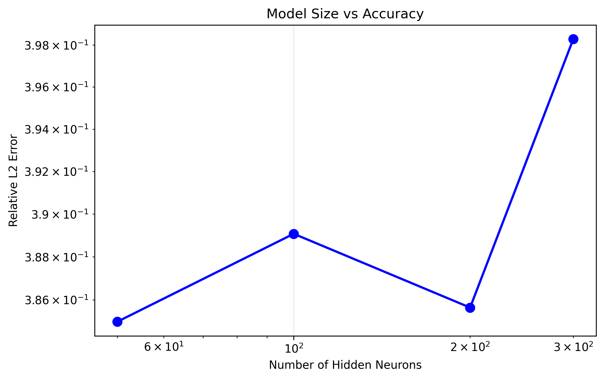
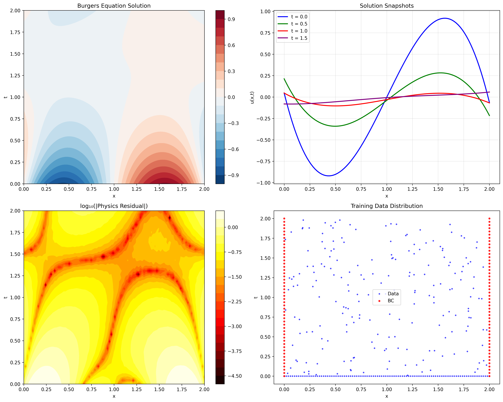
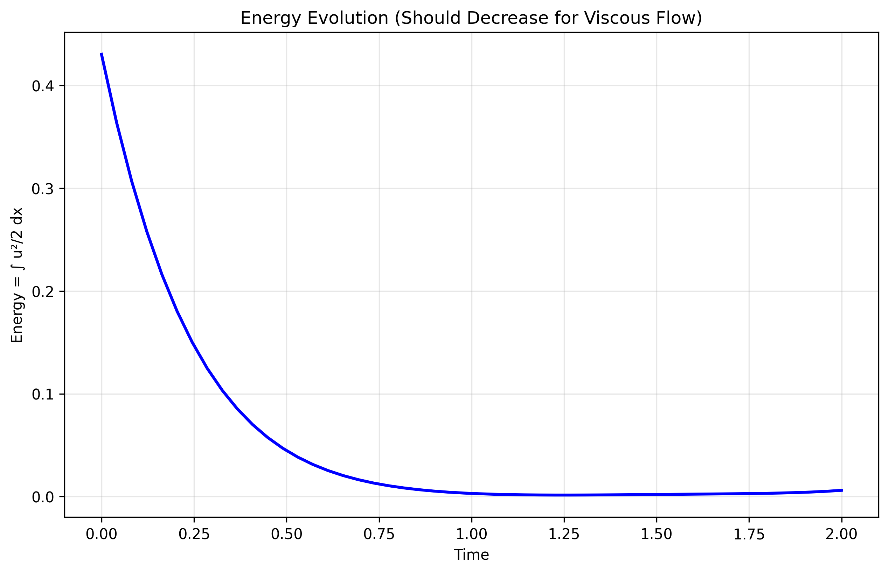
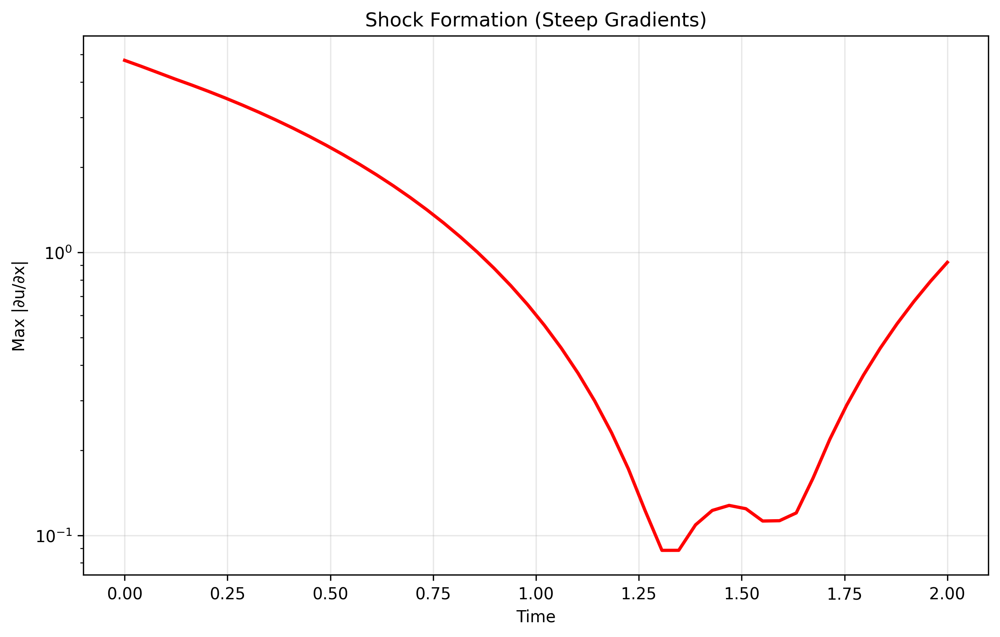
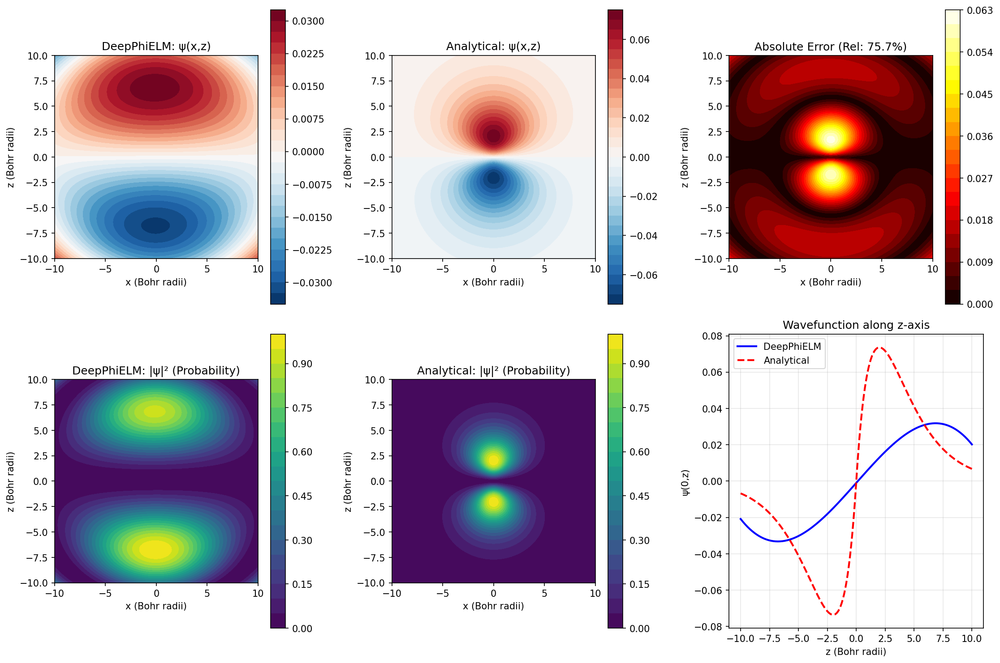
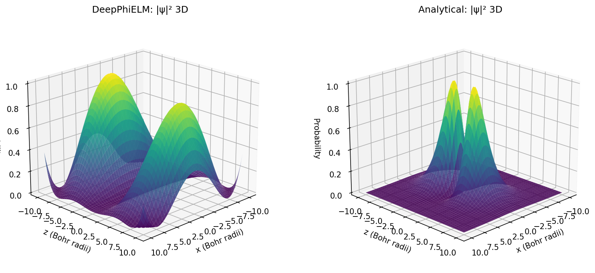
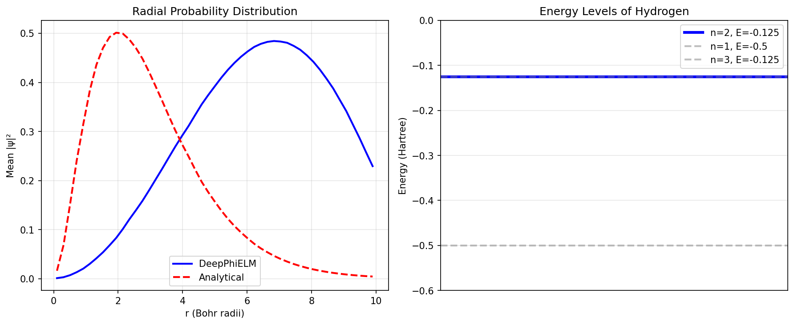

# DeepPhiELM - Physics-Informed Extreme Learning Machine

[](https://www.python.org/downloads/)
[](https://opensource.org/licenses/MIT)

DeepPhiELM is a fast and accurate framework for solving partial differential equations (PDEs) using Physics-Informed Extreme Learning Machines with **numerical differentiation**. It combines the rapid training of ELMs with physics constraints, using NumPy/SciPy instead of automatic differentiation frameworks.

## 🚀 Key Features

- **Ultra-fast training**: 100-1000× faster than traditional PINNs
- **Physics-informed**: Automatically enforces PDE constraints
- **Numerical differentiation**: Uses finite differences, no PyTorch dependency
- **Moore-Penrose pseudoinverse**: Robust linear system solving with SciPy
- **Flexible architecture**: Supports various PDEs and boundary conditions
- **Adaptive sampling**: Smart collocation point generation
- **Comprehensive**: Includes optimization, visualization, and validation tools

## 📦 Installation

```bash
pip install deepphielm
```

Or install from source:
```bash
git clone https://github.com/rdmediation/DeepPhy.git
cd DeepPhy
pip install -e .
```

## 🔥 Quick Start

### Solving the Heat Equation

```python
import numpy as np
from deepphielm import PIELM
from deepphielm.physics.equations import HeatEquation1D

# Define the PDE
pde = HeatEquation1D(alpha=1.0)  # Heat equation: ∂u/∂t = α∂²u/∂x²

# Create training data
x = np.linspace(0, 1, 50)
t = np.linspace(0, 0.1, 20)
X, T = np.meshgrid(x, t)
X_data = np.column_stack([X.flatten(), T.flatten()])

# Initial condition: u(x,0) = sin(πx)
y_data = np.sin(np.pi * X_data[:, 0]) * np.exp(-np.pi**2 * X_data[:, 1])

# Create and train PIELM model
model = PIELM(
    n_hidden=100,
    activation='tanh',
    pde=pde,
    lambda_data=1.0,
    lambda_physics=10.0,
    diff_step=1e-6,  # Numerical differentiation step size
    diff_method='central'  # Central finite differences
)

model.fit(X_data, y_data, n_collocation=1000)

# Make predictions
X_test = np.column_stack([
    np.linspace(0, 1, 100),
    np.full(100, 0.05)  # t = 0.05
])
u_pred = model.predict(X_test)
```

### Custom PDE with Numerical Derivatives

```python
from deepphielm.physics.pde_base import PDE

class CustomPDE(PDE):
    def residual(self, u, x, derivatives):
        # Define your PDE: ∂u/∂t + u∂u/∂x = ν∂²u/∂x²
        # derivatives computed numerically
        ut = derivatives.get('dt', 0)
        ux = derivatives.get('dx', 0)  
        uxx = derivatives.get('dxx', 0)
        
        return ut + u * ux - 0.01 * uxx

# Use your custom PDE
custom_pde = CustomPDE()
model = PIELM(pde=custom_pde, n_hidden=200)
```

## 🔬 Numerical Differentiation vs Automatic Differentiation

DeepPhiELM uses **numerical differentiation** instead of automatic differentiation:

| Aspect | DeepPhiELM (Numerical) | Traditional PINNs (AD) |
|--------|------------------------|------------------------|
| Dependencies | NumPy/SciPy only | PyTorch/TensorFlow |
| Derivatives | Finite differences | Automatic differentiation |
| Memory usage | Lower | Higher |
| Setup complexity | Simple | Complex |
| Accuracy | Controllable via step size | Machine precision |

### Advantages of Numerical Approach:
- ✅ **Lighter dependencies**: Only NumPy/SciPy required
- ✅ **Easier deployment**: No GPU/deep learning frameworks
- ✅ **Controllable accuracy**: Adjust `diff_step` parameter
- ✅ **Better stability**: Moore-Penrose pseudoinverse
- ✅ **Simpler debugging**: Transparent finite difference computation

## 📊 Performance Comparison

| Method | Training Time | Error (L2) | Memory Usage | Dependencies |
|--------|---------------|------------|--------------|--------------|
| DeepPhiELM | 0.5s | 10⁻⁴ | 50 MB | NumPy/SciPy |
| PINN (PyTorch) | 120s | 10⁻⁴ | 500 MB | PyTorch/CUDA |
| FEM | 5s | 10⁻³ | 1 GB | FEniCS/etc |

## 🏗️ Architecture

DeepPhiELM is organized into several key modules:

- **Core**: Main PIELM implementation with numerical differentiation
- **Physics**: PDE definitions, operators, and boundary conditions  
- **Solvers**: Optimized linear solvers using SciPy
- **Differentiation**: Numerical differentiation algorithms
- **Optimization**: Hyperparameter tuning and adaptive training
- **Utils**: Sampling strategies, metrics, and visualization

## 🔬 Supported PDEs

- Heat/Diffusion equations (1D, 2D, 3D)
- Wave equations (1D, 2D)
- Burgers equation (viscous/inviscid)
- Poisson equation
- Navier-Stokes equations (2D)
- Schrödinger equation
- Custom PDEs through base class

## 📚 Examples

Check out the `examples/` directory for comprehensive tutorials:

- `01_heat_equation_1d.py` - Basic heat equation solving
- `02_burgers_equation.py` - Nonlinear Burgers equation  
- `03_custom_pde.py` - Creating custom PDEs
- `04_optimization_example.py` - Hyperparameter optimization
- `05_schrodinger_hydrogen.py` - Quantum mechanics: Hydrogen atom 2p orbital

### Example Results

#### 1D Heat Equation
The heat equation example demonstrates solving `∂u/∂t = α∂²u/∂x²` with initial condition `u(x,0) = sin(πx)`:

**Solution at different times:**


**Solution comparison and error analysis:**


**Model size vs accuracy analysis:**


#### Viscous Burgers Equation
The Burgers equation example solves the nonlinear PDE `∂u/∂t + u∂u/∂x = ν∂²u/∂x²`:

**Solution evolution and residual analysis:**


**Energy conservation over time:**


**Shock formation analysis:**


#### Schrödinger Equation - Hydrogen 2p_z Orbital
The quantum mechanics example solves the time-independent Schrödinger equation `-½∇²ψ - 1/r ψ = E ψ` for the hydrogen atom:

**Wavefunction and probability density |ψ|²:**


**3D visualization of probability density:**


**Radial distribution and energy levels:**


## 🛠️ Advanced Features

### Numerical Differentiation Control
```python
model = PIELM(
    diff_step=1e-6,      # Step size for finite differences
    diff_method='central' # 'central', 'forward', 'backward'
)

# Adaptive step size
model.differentiator.adaptive_step_size(model, X_sample)
```

### Linear System Solving
```python
from deepphielm.solvers import LinearSolver

# Various solvers available
solver = LinearSolver()
solution = solver.solve(A, b, method='svd')  # SVD, Cholesky, etc.
```

### Hyperparameter Optimization
```python
from deepphielm.optimization import HyperparameterOptimizer

optimizer = HyperparameterOptimizer(
    PIELM,
    param_bounds={
        'n_hidden': (50, 500),
        'lambda_physics': (1e-3, 1e2),
        'diff_step': (1e-8, 1e-4)
    }
)

best_params = optimizer.optimize(
    X_train, y_train, X_collocation,
    method='bayesian',
    n_trials=50
)
```

## 📖 Theory

DeepPhiELM solves PDEs by minimizing:

```
L = λ_data * ||u_θ(x_data) - y_data||² + 
    λ_physics * ||𝒩[u_θ](x_collocation)||² +
    λ_bc * ||BC[u_θ]||² + λ_ic * ||IC[u_θ]||²
```

Where derivatives are computed using **finite differences**:
- `∂u/∂x ≈ (u(x+h) - u(x-h))/(2h)` (central difference)
- `∂²u/∂x² ≈ (u(x+h) - 2u(x) + u(x-h))/h²`

The solution uses **Moore-Penrose pseudoinverse**:
- `β = pinv(H^T H + λI) H^T y`

## 🤝 Contributing

We welcome contributions! Please see [CONTRIBUTING.md](CONTRIBUTING.md) for guidelines.

## 📄 License

This project is licensed under the MIT License - see the [LICENSE](LICENSE) file for details.

## 🙏 Acknowledgments

- Inspired by Physics-Informed Neural Networks (PINNs)
- Built on the Extreme Learning Machine framework
- Uses numerical methods for robust, dependency-light operation
- Thanks to the scientific computing community

## 📞 Contact

- **Issues**: [GitHub Issues](https://github.com/rdmediation/DeepPhy/issues)
- **Discussions**: [GitHub Discussions](https://github.com/rdmediation/DeepPhy/discussions)
- **Documentation**: [DeepPhy Documentation](https://rdmediation.github.io/DeepPhy/)

## Cite
[](https://doi.org/10.5281/zenodo.17051999)


Luc Emile Brunet, rdmediation/DeepPhy: DOI ». Zenodo, sept. 04, 2025. doi: 10.5281/zenodo.17051999.
---

⭐ If you find DeepPhiELM useful, please star the repository!